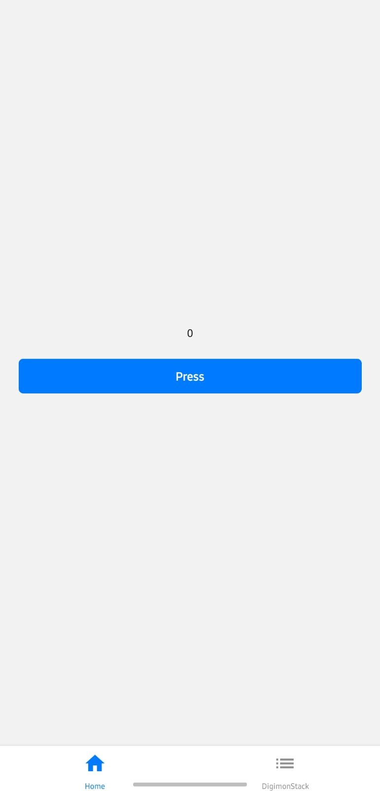
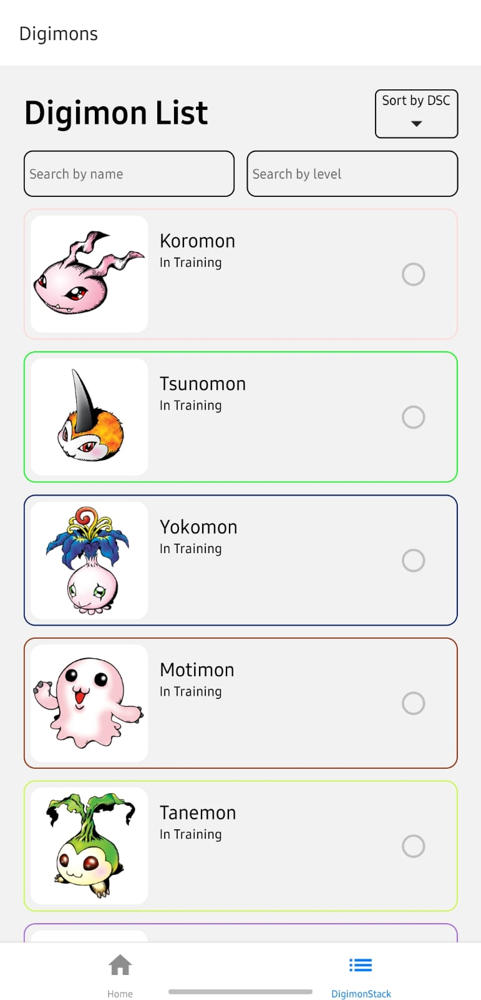
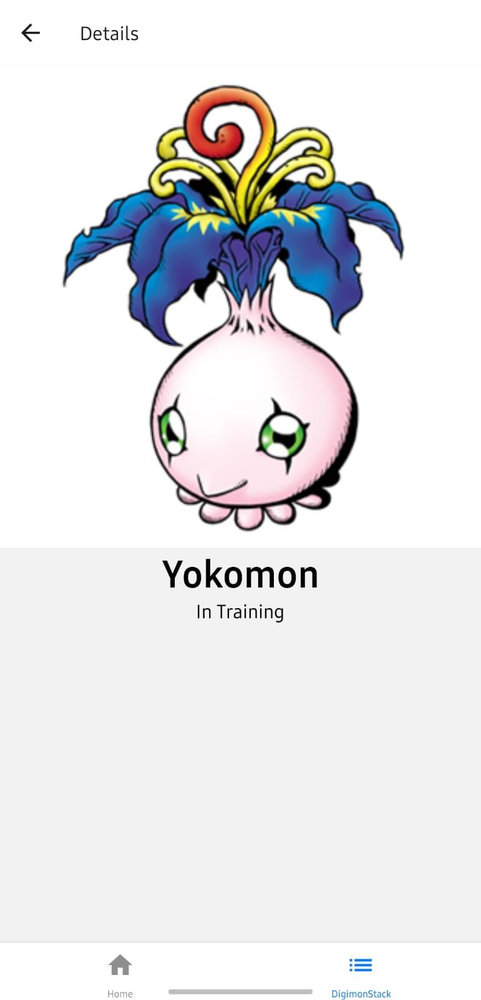
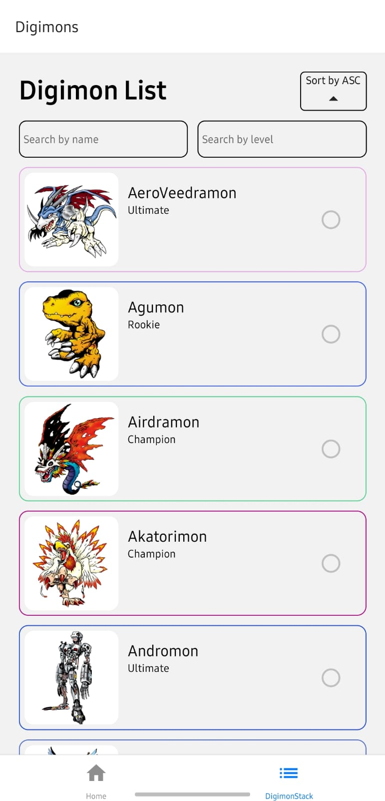
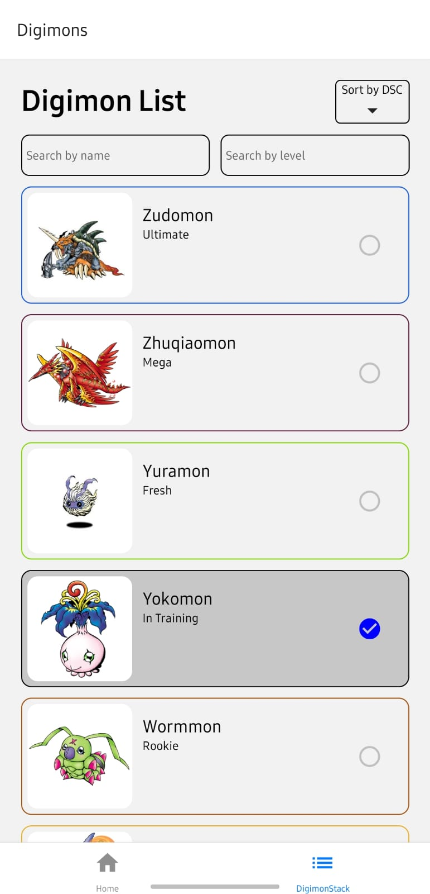
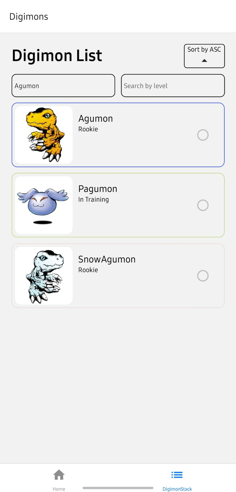
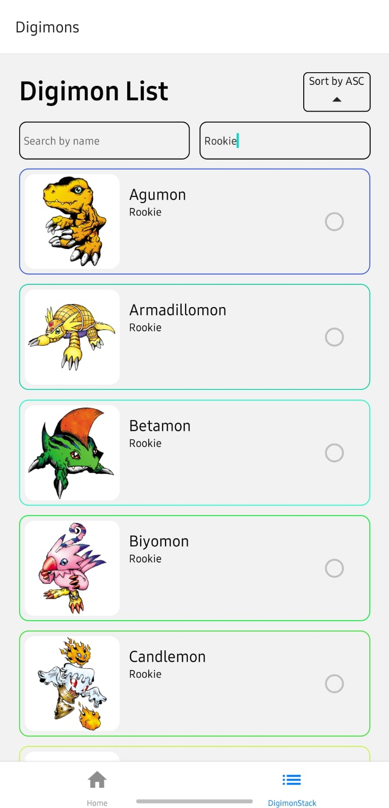

## Digimons

U nastavku je kratka dokumentacija izrađene mobilne aplikacije tijekom onboardinga za posao React Native developera.
Otvaranjem aplikacije prikazuje se početni zaslon s countereom i gumbom za pritisak kojim se counter povećava za jedan. Kad se pritisne na gumb aktiviraju se i animacije - counter se miče lijevo desno i scale-a, a gumb ide gore dolje i mijenja prozirnost (dolje - nedtaje, gore - nastaje). U dnu početnog zslona prikazuje se traka s tabovima - Home i DigimonStack

Pritiskom na DigiomonStack otvara se screen s listom digimona koji čiji podaci su dostupni na API-ju (https://digimon-api.vercel.app/api/digimon). Svaki digiomn je prikazan u zasebnoj kartici čiji je obrub nasumične boje. Postoji i checkbox za svaki digimon pritiskom na koji se on označi. Osim što se tako može označiti, checkbox se označi i kad se digimon pojedninačno otvori u ekranu detalja. Dohvaćanje podataka s API-ja je optimizirano funkcijama callback i memo. 

Na ekranu detalja iz liste se prosljeđuje ime, slika i level pojedinog digimona. 

Na ekranu gdje je prikazana lista svih digimona omogućena su i sortiranja uzlazno i slilazno po imenu digiomna, a moguće je i pretraživanje digiomna po imenu ili levelu.

